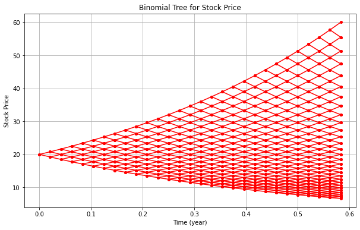

## Numeric HW3
Boyu Yang: question 4
Julius Gruber and Ziyuan Li: question 2 & 3
Yicheng Sun: general question, question 1

## General Questions
### (1)
Construct the following portfolio: 
i) long $e^{-q\delta t}$ unit of $S$; ii) short $S(0)e^{-q\delta t}$ unit of cash
 Then at time 0, we have $V(0) = e^{-q\delta t}S(0) - S(0)e^{-q\delta t} = 0$.

At time $\delta t$, we have $V(\delta t) = S(\delta t) - S(0)e^{(r-q)\delta t}$
According to the no arbitrage condition, we obtain
$$
V_{up}(\delta t) = S(0)(u-e^{(r-q)\delta t}) >0 \\
V_{down}(\delta t) = S(0)(d-e^{(r-q)\delta t}) <0
$$

so we get the result: $$d<e^{(r-q)\delta t}<u$$

### (2)

### (3)
Plug in $u=e^{\sigma\sqrt{\delta t}}, d=e^{-\sigma\sqrt{\delta t}}$, when $\delta t\to0$, we obtain
$$
\begin{align*}
{\frac{e^{(r-q)\delta t}-d}{u-d}-\frac{1}{2}}&={\frac{e^{(r-q)\delta t}-e^{-\sigma\sqrt{\delta t}}}{e^{\sigma\sqrt{\delta t}}-e^{-\sigma\sqrt{\delta t}}}-\frac{1}{2}} \\&
=\frac{1+(r-q)\delta t+O(\delta^2t^2)-(1-\sigma\sqrt{\delta t}+1/2*\sigma^2\delta t)+O(({\delta t})^{3/2})}{(1+\sigma\sqrt{\delta t}+1/2*\sigma^2\delta t)-(1-\sigma\sqrt{\delta t}+1/2*\sigma^2\delta t)+O(({\delta t})^{3/2})}-\frac{1}{2}\\
&=\frac{\sigma\sqrt{\delta t}+(r-q-1/2*\sigma^2)\delta t+O(({\delta t})^{3/2})}{2\sigma\sqrt{\delta t}+O(({\delta t})^{3/2})}-\frac{1}{2}\\
&=\frac{1}{2\sigma}{(r-q-\frac{1}{2}\sigma^2)\sqrt{\delta t}+O(\delta t)}
\end{align*}
$$
That is 
$$
{\frac{e^{(r-q)\delta t}-d}{u-d}=\frac{1}{2}}+\frac{1}{2}{(\frac{r-q}{\sigma}-\frac{\sigma}{2})\sqrt{\delta t}+O(\delta t)}
$$

### (4)
Consider $S$ moves $k$ steps up and $N-k$ steps down, we have
$$
\begin{align*}
&S_N(T)=S_0u^kd^{N-k}=S_0u^{2k-N} \\
&log(\frac{S_N}{S_0})=(2k-N)log(u)=(2k-N)\sqrt{T/N}\sigma
\end{align*}
$$
Therefore
$$
Z = log(\frac{S_N}{S_0})/\sigma\sqrt{T}=\frac{2k-N}{\sqrt{N}}
$$
Calculating the GMF of Z, as $N\to\infty$, we obtain
$$
\begin{align*}
\mathbb E(e^{tZ})&=\sum_{k=0}^{N}e^{\frac{2k-N}{\sqrt{N}}t}C_N^kp^k(1-p)^{N-k}\\
&=e^{-\sqrt Nt}\sum_{k=0}^{N}C_N^k(pe^{\frac{2t}{\sqrt N}})^k(1-p)^{N-k}\\
&=e^{-\sqrt Nt}(1+(e^{\frac{2t}{\sqrt N}}-1)p)^N\\
&=e^{-\sqrt Nt}(1+(\frac{1}{2}+\frac{1}{2}(\frac{r-q}{\sigma}-\frac{\sigma}{2})\sqrt{\delta t}+O(\delta t))(\frac{2t}{\sqrt T}\sqrt{\delta t}+\frac{2t^2}{T}\delta t+O((\delta t)^{3/2})))^N\\
&=(1-\frac{t}{\sqrt N}+\frac{t^2}{2N}+O(\frac{1}{N^{3/2}}))^N(1+\frac{t}{\sqrt N}+(t^2+(\frac{r-q}{\sigma}-\frac{\sigma}{2})t\sqrt T)\frac{1}{N}+O(\frac{1}{N^{3/2}}))^N\\
&=(1+(\frac{t^2}{2}+(\frac{r-q}{\sigma}-\frac{\sigma}{2})t\sqrt T)\frac{1}{N})^N\\
&=exp\{\frac{t^2}{2}+(\frac{r-q}{\sigma}-\frac{\sigma}{2})t\sqrt T\}
\end{align*}
$$
so we have
$$
\begin{align*}
\mathbb E(e^{tlog(\frac{S_N}{S_0})})=\mathbb E(e^{t\sigma\sqrt{T}Z})=exp\{\frac{\sigma^2T^2}{2}t^2+(r-q-\frac{\sigma^2}{2})Tt\}
\end{align*}
$$
by which we conclude that
$$
\lim_{N\to\infty}log(\frac{S_N}{S_0})\sim\N((r-q-\frac{\sigma^2}{2})T, \sigma^2T^2)
$$